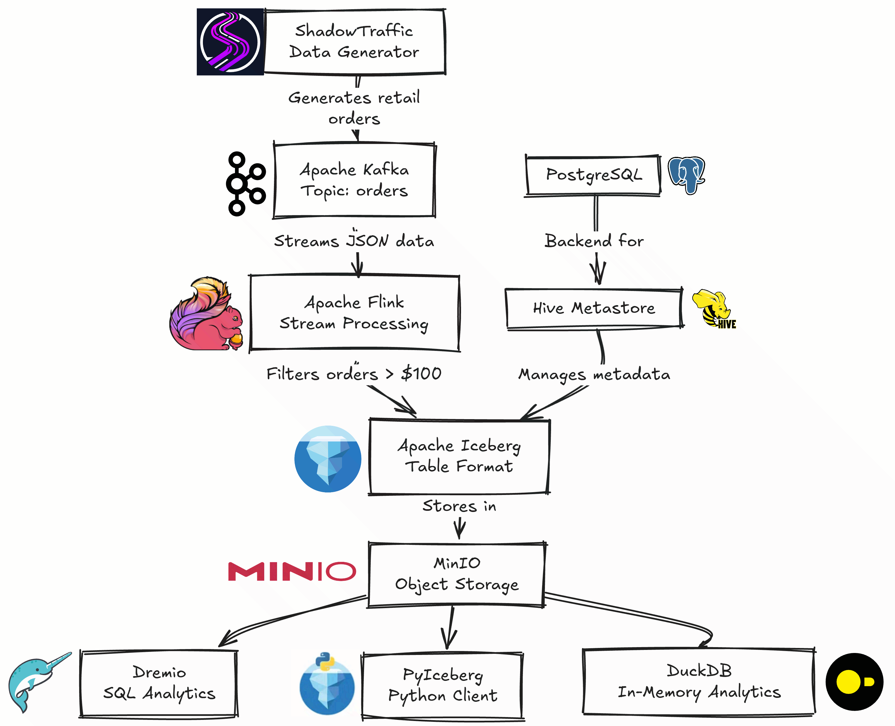
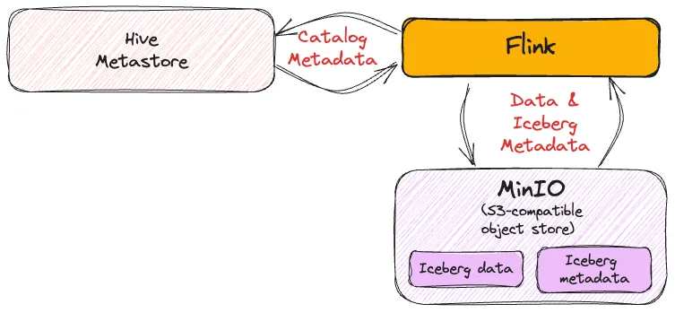

<div align="center">

# 🌊 Kafka to Iceberg Data Pipeline

<p align="center">
  
  
  
  
  
  
  
  
</p>


</div>

This project demonstrates a real-time data pipeline that streams data from Apache Kafka to Apache Iceberg using Apache Flink SQL. The pipeline processes retail order data and stores it in Iceberg format on MinIO object storage.

## Architecture

The project consists of the following components:

- **Apache Flink** - Stream processing engine for real-time data transformation
- **Apache Kafka** - Message broker for streaming data
- **Apache Iceberg** - Table format for large analytic datasets
- **MinIO** - S3-compatible object storage
- **Hive Metastore** - Metadata management for Iceberg tables
- **PostgreSQL** - Backend database for Hive Metastore
- **ShadowTraffic** - Data generator for realistic retail data
- **Dremio** - Data lake analytics platform
- **PyIceberg** - Python client for Iceberg
- **DuckDB** - In-memory analytical database
- **kcat** - Kafka command-line tool

## Prerequisites

- Docker and Docker Compose
- At least 8GB of available RAM
- ShadowTraffic license (place in `shadowtraffic/license.env`)

## Quick Start

1. **Start all services:**
   ```bash
   docker compose up -d
   ```

2. **Wait for all services to be healthy** (may take 2-3 minutes)

3. **Run the Flink SQL pipeline:**
   ```bash
   docker compose exec -it jobmanager bash -c "./bin/sql-client.sh -f /data/kafka-to-iceberg-new.sql"
   ```

## Data Flow


### Catalog Integration

<div align="center">
  


*Iceberg Catalog Integration: Hive Metastore manages catalog metadata for Flink to access Iceberg tables stored in MinIO*

</div>

To use Iceberg you need to have a catalog metastore. Catalogs in Flink can be a bit complex to understand at first, but this diagram shows how the **Hive Metastore** works as the catalog provider for **Flink** to manage **Iceberg** data and metadata stored in **MinIO** (S3-compatible object store).

## Accessing Services

| Service | URL | Credentials |
|---------|-----|-------------|
| Flink Web UI | http://localhost:8081 | - |
| MinIO Console | http://localhost:9001 | admin/password |
| Dremio | http://localhost:9047 | - |
| Kafka | localhost:9092 | - |
| PostgreSQL | localhost:5432 | hive/hive |


## Troubleshooting

1. **Services not starting**: Ensure you have enough memory and no port conflicts
2. **Flink SQL errors**: Check that all dependent services are healthy first
3. **Data not flowing**: Verify ShadowTraffic license is valid and placed correctly
4. **Storage issues**: Check MinIO is accessible and warehouse bucket exists

## Cleanup

```bash
docker compose down -v
docker system prune -f
```

## Contributing

1. Fork the repository
2. Create a feature branch
3. Make your changes
4. Test the pipeline end-to-end
5. Submit a pull request

## License

This project is for educational and demonstration purposes.
